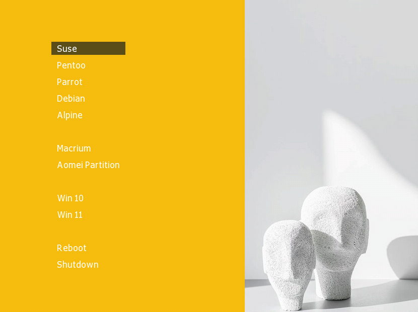
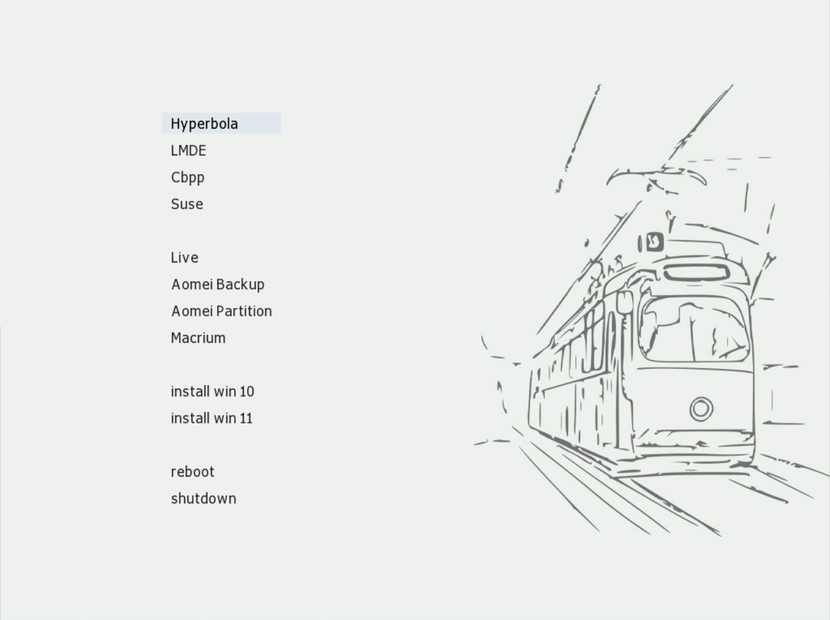
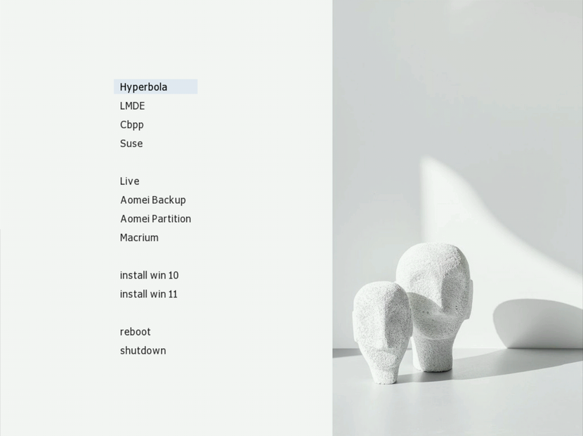
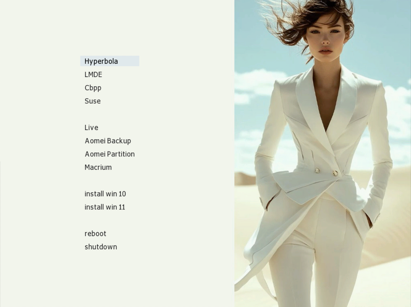

<h1 align="center">   

Multiboot USB Flash Drive   

<sub>Creating a multiboot USB flash drive</sub>

</h1>   

<p align="center">
Universal multiboot USB flash drive with support for Windows, Linux, WinPE and UEFI/Legacy BIOS.
</p>   

<p align="center">

</p>   

<p align="center">
  
</p>   

## Quick start


## Contents

- [Quick Start](#quick-start)
- [Features](#features)
- [Supported Images](#supported-images)
- [How to Make the USB Flash Drive Bootable](#how-to-make-the-usb-flash-drive-bootable)
- [Preparing a Windows ISO Image](#preparing-a-windows-iso-image)
- [WinContig — Analysis and Defragmentation](#wincontig-analysis-and-defragmentation)
- [Themes](#themes)  

## Features   

- BIOS/UEFI
- Windows ISO
- Linux ISO
- WinPE/LiveCD
- Themes
- Multiple ISOs on a single USB drive

## Supported ISOs

- Windows 10 / 11
- Macrium Reflect
- WinPE / LiveCD environments
- Arch Linux
- Kali Linux
- CachyOS
- Debian-based distributions
- Most modern Linux distributions   

## How to make the USB flash drive bootable   

**Installing the bootloader**   

> [!IMPORTANT]
> The USB flash drive must be formatted as one partition.   

#### Select a File System

**FAT32/NTFS**→ Choose the file system that best suits your needs.   

> [!IMPORTANT]
> FAT32 → does not support files larger than 4 GB   

#### Activate the Partition

Open Bootice and select your USB drive.   

#### Formatting a USB flash drive   

```
File System
├─ FAT32/NTFS
└─ Start LBA → 2048
```   

| File system | Features |
|---|---|
| FAT32 | Compatible, but files up to 4 GB |
| NTFS | Supports large ISO files |   

```
Parts Manage
├─ Re-Partitioning
├─ USB-HDD mode (Single Partition)
└─ Activate
```   

#### Install MBR   

``` 
Bootice
└─ Process MBR
    └─Windows NT 5.x/6.x
        └─ Install
```   

#### Install PBR   

```
Bootice
└─ Process PBR
   └─ Grub4Dos
      └─ Install
         └─ Version 0.4.6a
```   

#### Creating a Multiboot USB Drive   

- Format the USB flash drive using → **Bootice → Parts Manage → Repartitioning**.   
- Using BOOTICE, perform Re-Partitioning as described in the section above. → **How ​​to make the USB flash drive bootable**.   
- Copy the contents of the folder → **USB-Files** to the USB flash drive.   
- Integrate the driver → FiraDisk **into** the Windows ISO image.   
- Copy the ISO image to the folder → **ISO**.   
- Edit the file → **menu.lst** so that the ISO paths and names match.   
- Copy the Linux distributions to the **TUX** folder   
- Copy WinPE / LiveCD images to the **PE** folder   

> [!IMPORTANT]
> If desired, all ISOs can be stored in one directory.   
> Folders "ISO, TUX, PE, Apps" are created solely for convenience.   

#### Structure of a multiboot flash drive   

```
Multiboot USB root/
│
├──GFX/
│ ├── mac.gz
│ └── unifont.hex.gz
│
├── Apps/
│
├── ISO/
├── PE/
├── TUX/
│
├── AutoUnattend.xml
├── GRLDR
├── liveusbl
├── winpeshl.ini
│
└── menu.lst
```   

> [!IMPORTANT]
> A multiboot flash drive created using this scheme works in both BIOS Legacy and UEFI.   

> [!WARNING]
> Some ISO images may require disabling Secure Boot in the BIOS/UEFI to boot.   

## Preparing a Windows ISO image   

To run Windows installation from a USB flash drive, you need to integrate the **FiraDisk driver** into the ISO image.   
For this purpose → **FiraDisk_integrator** is used.   

```
Create a working folder
├─ Use Latin characters in the folder name
├─ No spaces
├─ Maximum 8 characters
├─ Copy the Windows ISO into the folder
├─ Place the FiraDisk_integrator script in the same folder
└─ Run the script as administrator
```   

> [!IMPORTANT]
> You can copy several Windows ISO, of different editions and 32-bit and 64-bit versions.   
> The script processes all ISO images located in the same folder sequentially and, based on them, creates its own ISO images with the FiraDisk driver.   

## WinContig — Analysis & Defragmentation   

When working with multiboot flash drives, ISO files should not be fragmented.   

> [!IMPORTANT]
> If the ISO is fragmented, errors or problems may occur while loading the ISO into memory.   

**ISO check**   

```
WinContig → Analyze
```   

> [!IMPORTANT]
> If the program shows the need for optimization, perform defragmentation.   

**Defragmentation**→ launch WinContig   

```
List of drives
├─ Select flash drive
├─ Properties
├─ Service
├─ Check
└─ Optimize
```   

## Themes

**Themes** → located in the `make_skins/skins` folder

How to Install a New Theme   

```
Select the skin file → for example → mac.gz   
├─ Copy it to the folder → GFX
├─ Edit → menu.lst 
├─ Find the line → gfxmenu /GFX/sony.gz
└─ Replace → sony.gz with mac.gz
```   

### Screenshots

| City | Art | Yellow | Moda |
|------|------|------|------|
|  |  |  |  |   

## GitHub

Source files, configs, and themes:   

[yojeero/usb_multiboot](https://github.com/yojeero/usb_multiboot) /[in Russian](https://github.com/yojeero/usb_multiboot/blob/main/README_Ru.md)   

<p align="center">

</p>