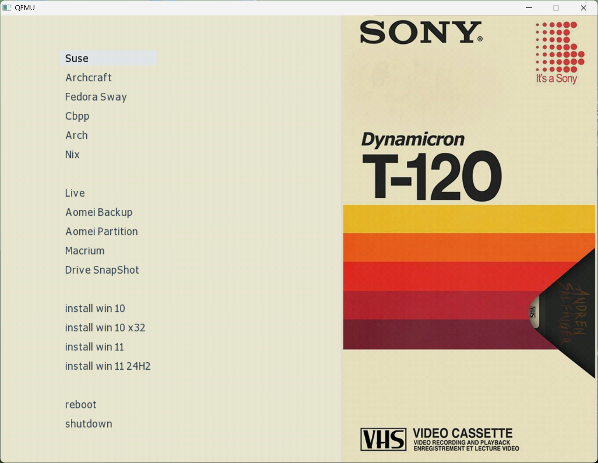

### Общая информация по разделам.

Флешка форматированная как винчестер и сам винчестер с классическим MBR могут иметь до 4 разделов. Разделы бывают основные - на такие устанавливается ОС (потому что они загрузочные), и расширенный раздел. В расширенном создаются логические диски (до 128 штук), они не могут быть загрузочными для Windows, в Linux есть исключения. 

- (hd0,0) первый основной раздел. 
- (hd0,3) четвертый основной раздел куда будет смонтирован образ. 
- (hd0,4) и старше логические диски.

#### Чтоб получить флешку как (hd0,0) нужно отформатировать ее одним разделом.

### Форматируем флешку под мультизагрузочную.

Bootice (выбрать флешку) > Parts manage > Re-Partitioning > USB-HDD mode (Single Partition) > File System FAT32/NTFS (выбрать на свое усмотрение, единственно что FАТ32 не поддерживает файлы весом 4Гб или более) - поэтому выбираем NTFS > Start LBA 2048 > ОК > Ок.

### Как сделать флешку загрузочной.

1) Bootice (выбрать флешку) > Parts manage > Activate (нажать, если активна, если нет - оставить как есть).
2) Bootice > Process MBR > Windows NT 5.x/6.x > Install > Windows NT 6.x > OK.
3) Bootice > Process PBR > Grub4Dos > Install > Version 0.4.6а > ОК > ОК.

### Для USB-HDD.

Создать основой раздел или использовать имеющийся, сделать его активным и установить MBR, PBR. Чтоб не было проблем с некоторыми биосами, раздел должен быть до 128 Гб и находится в начале диска.

### Создаем мультизагрузочную USB-флешку.
 
- Форматируем флешку в Bootice > Parts Manage > Repartitioning (в FAT32 - дольше проработает и быстрее, в NTFS - для поддержки файлов рамером больше 4гб).
- С помощью программы BOOTICE устанавливаем загрузчик, как прописано выше в пункте - **Как сделать флешку загрузочной**.
- Содержимое папки «USB-Files» копируем на флешку.
- Интегрируем FiraDisk драйвер в ISO-образ Windows и копируем его на флешку в папку ISO (можете назвать как угодно) и переименовываем ISO-образ на свое усмотрение.
- Если программа WinContig после копирования образов на флешку покажет после анализа, что нужна дефрагментация - дефрагментируем ISO-образы на флешке.
- Отредактируйте пункты меню оболочки > menu.lst, чтобы пути к ISO-шникам были правильные и названия образов совпадали.
- Копируете любой дистрибутив Linux в папку LUX (можете назвать как угодно).
- Копируете нужный вам WinPE LiveCD в папку PE (можете назвать как угодно).

```
Папки "ISO, LUX, PE, Soft" создаем для удобства - можно складывать все ISO-образы в одну общую папку.
```

### Структура мультизагрузочной USB-флешки.

Multiboot USB root/                             
    ├── GFX/                                   
         └── mac.gz                               
         └── unifont.hex.gz      
         
    ├── ISO/                                    
    ├── LUX/                                    
    ├── PE/                                     
    ├── Soft/ 
    
    ├── AutoUnattend.xml  
    ├── GRLDR    
    ├── liveusbl  
    ├── winpeshl.ini                     
    └── menu.lst                               


    ### <span style="color: #1589F0">Мультизагрузочная USB-флешка, собранная по этой схеме, будет работать и в BIOS Legacy и в UEFI.</span>

. . . . . . . . . . . . . . . . . . . . . . . . . . . . . . . . . . . . . . . . . . . . . . . . . . . . . . .

 ### Prebuild подготовка.

- FiraDisk_integrator - утилита для интеграции FiraDisk в образы Windows.
- WinContig - программа дефрагментации файлов на флешке.
- MobaLive USB.exe - программа для тестирования готовой USB-флешки под Windows.

### Образы Windows.

Для того, чтобы образ Windows запустился на установку с данной флешки, необходимо интегрировать FiraDisk драйвер в ISO-образ. 
Для этого используется скрипт > FiraDisk_integrator.
Данный скрипт интегрирует FiraDisk драйвер в установочный образ Windows, что позволяет произвести установку Windows из ISO образа с помощью Grub4Dos.

- Для интеграции FiraDisk драйвера в дистрибутив Windows, создайте папку в корневой директории вашего жесткого диска. Имя папки должно быть на латинице без пробелов и содержать не более 8 символов. Жесткий диск должен иметь достаточное количество свободного места для создании копии образа Windows.
- Создаем папку, например с названием «FiraDisk» и копируем в нее ISO-образ дистрибутива Windows. Можно скопировать несколько образов Windows, разных редакций и разрядности. Все зависит от объема Вашей флешки.
- Копируем в эту же папку скрипт «FiraDisk_integrator».
- Запускаем скрипт «FiraDisk_integrator» от имени администратора. Скрипт по очереди обрабатывает все ISO-образы, что лежат рядом с ним и на их основе создает свои ISO-образы с FiraDisk-драйвером.

```
Примечание: На время работы скрипта FiraDisk_integrator желательно отключить антивирус!
```
### WinContig анализ и дефрагментация.

Многие пользователи сталкивались с ошибкой «недостаточно свободных непрерывных кластеров» при попытке произвести дефрагментацию образа ISO для его работы в мультизагрузочной флешке или HDD. Для дефрагментации ISO образов будем использовать программу WinContig. Она показывает данную ошибку. 

При создании мультизагрузочного диска, ІЅО файлы помещаются в специальную папку. На диске файл хранится не в одном месте, а разбит по множеству секторов, и при попытке прочитать подобный ІЅО, система сталкивается с проблемой. Для того, чтобы ISO файл работал нормально, необходимо чтобы он был непрерывен, т.е. не разбросан по секторам, а шел в последовательности. Если этого не происходит, то система не может стабильно выгрузиться в оперативную память. 

Выбираем > Анализировать и смотрим требуется ли на флешке Оптимизация ISO-шников. 

Если требуется >

Запускаем WinContig > идем в список накопителей > выбираем накопитель где хранятся ISO образы > выбираем Свойства > Сервис > Проверить и там выбираем > Оптимизировать.

. . . . . . . . . . . . . . . . . . . . . . . . . . . . . . . . . . . . . . . . . . . . . . . . . . . . . . .

### В папке make_skins > skins лежат готовые скины

Для использования другого скина берем любой скин > к примеру > mac.gz.
Копируем его на флешку в папку GFX.
Открываем в текстовом редакторе файл menu.lst.
Меняем название установленного скина "sony.gz" на новый "mac.gz".
в строке > gfxmenu /GFX/sony.gz и сохраняем изменения.
Радуемся новому оформлению!

#### Список скинов:

- color.gz
- cube.gz
- mac.gz
- modus.gz
- sony.gz

#### Превью скинов лежат в папке > preview


