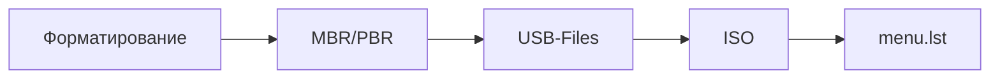

  

### Multiboot USB Flash   

> [!TIP]
> Support for Windows, Linux, WinPE.    
> Support for UEFI and Legacy BIOS (MBR).   

### Быстрый старт


```mermaid
graph LR;
Format[Форматирование] --> Boot[MBR/PBR]
Boot --> Files[USB-Files]
Files --> ISO[ISO]
ISO --> Menu[menu.lst]
```   

### Содержание

- [Быстрый старт](#быстрый-старт)
- [Возможности](#возможности)
- [Поддерживаемые образы](#поддерживаемые-образы)
- [Как сделать флешку загрузочной](#как-сделать-флешку-загрузочной)
- [Подготовка ISO-образа Windows](#подготовка-iso-образа-windows)
- [WinContig — анализ и дефрагментация](#wincontig--анализ-и-дефрагментация)
- [Темы](#темы)   

### Возможности   

- BIOS / UEFI
- Windows ISO
- Linux ISO
- WinPE / LiveCD
- Темы оформления
- Несколько ISO на одной флешке

### Поддерживаемые образы   

- Windows 10 / 11
- Macrium Reflect
- WinPE / LiveCD environments
- Arch Linux
- Kali Linux
- CachyOS
- Debian-based distributions
- Most modern Linux distributions   

### Как сделать флешку загрузочной   

**Установка загрузчика**   

> [!IMPORTANT]
> USB-флешку необходимо отформатировать одним разделом.   

**Выбор файловой системы**   

**FAT32/NTFS**  →  выбрать на свое усмотрение   

> [!IMPORTANT]
> FАТ32  → не поддерживает файлы размером более 4 ГБ   

#### Активация раздела   

Откройте Bootice и выберите USB-накопитель.   

#### Форматирование USB-флешки   

```
File System
├─ FAT32/NTFS
└─ Start LBA → 2048
```   

| Файловая система | Особенности |
|---|---|
| FAT32 | Совместимость, но файлы до 4 ГБ |
| NTFS | Поддержка больших ISO |   

```
Parts Manage
├─ Re-Partitioning
├─ USB-HDD mode (Single Partition)
└─ Activate
```   

#### Установить MBR   

``` 
Bootice
└─ Process MBR
    └─ Windows NT 5.x / 6.x
        └─ Install
```   

#### Установить PBR   

```
Bootice
└─ Process PBR
   └─ Grub4Dos
      └─ Install
         └─ Version 0.4.6a
```   

#### Все шаги создания мультизагрузочной флешки   

- Отформатируйте флешку используя → **Bootice → Parts Manage → Repartitioning**.   
- С помощью BOOTICE установите загрузчик, как прописано выше → **Как сделать флешку загрузочной**.   
- Скопируйте содержимое папки → **USB-Files** на флешку.   
- Интегрируйте драйвер → **FiraDisk** в ISO-образ Windows.   
- Скопируйте ISO-образ в папку → **ISO**.   
- Отредактируйте файл → **menu.lst**, чтобы пути к ISO и названия совпадали.   
- Скопируйте Linux-дистрибутивы в папку → **TUX**   
- Скопируйте WinPE / LiveCD в папку → **PE**   

> [!IMPORTANT]
> При желании все ISO можно хранить в одной директории.   
> Папки "ISO, TUX, PE, Apps" создаются исключительно для удобства.   

#### Структура мультизагрузочной флешки   

```
Multiboot USB root/
│
├── GFX/
│   ├── mac.gz
│   └── unifont.hex.gz
│
├── Apps/
│
├── ISO/
├── PE/
├── TUX/
│
├── AutoUnattend.xml
├── GRLDR
├── liveusbl
├── winpeshl.ini
│
└── menu.lst
```   

> [!IMPORTANT]
> Мультизагрузочная флешка, созданная по этой схеме, работает как в BIOS Legacy, так и в UEFI.   

> [!WARNING]
> Для загрузки некоторых ISO-образов может потребоваться отключение Secure Boot в BIOS/UEFI.   

### Подготовка ISO-образа Windows   

Для запуска установки Windows с флешки необходимо интегрировать **драйвер FiraDisk** в ISO-образ.   
Для этого используется → **FiraDisk_integrator**.   

```
Создайте рабочую папку
├─ Имя папки — латиницей
├─ Без пробелов
├─ Не более 8 символов
├─ Скопируйте в папку ISO-образ Windows
├─ Скрипт FiraDisk_integrator
└─ Запустите скрипт от имени администратора
```   

> [!IMPORTANT]
> Можно скопировать несколько образов Windows, разных редакций и разрядности.   
> Скрипт по очереди обрабатывает все ISO-образы, что лежат рядом с ним и на их основе создает свои ISO-образы с FiraDisk-драйвером.   

### WinContig — анализ и дефрагментация   

При работе с мультизагрузочными флешками ISO-файлы не должны быть фрагментированы.   

> [!IMPORTANT]
> Если ISO фрагментирован, могут возникнуть ошибки или проблемы при загрузке ISO в память.   

**Проверка ISO**   

```
WinContig → Анализировать
```   

> [!IMPORTANT]
> Если программа показывает необходимость оптимизации — выполните дефрагментацию.   

**Дефрагментация** → запускаем WinContig   

```
Список накопителей
├─ Выбрать флешку
├─ Свойства
├─ Сервис
├─ Проверить
└─ Оптимизировать
```   

### Темы

**Скины оформления** → в папке make_skins/skins   

Как установить новый скин   

```
Выберите файл скина → к примеру → mac.gz   
├─ Скопируйте его в папку → GFX
├─ Отредактируйте → menu.lst 
├─ Найдите строку → gfxmenu /GFX/sony.gz
└─ Замените → sony.gz на mac.gz
```   

### Скриншоты

| City | Art | Yellow | Moda |
|------|------|------|------|
|  |  |  |  |   

### GitHub

Исходники, конфиги и темы оформления:   

- [Multiboot USB](https://github.com/yojeero/usb_multiboot)   
- [Multiboot USB на русском](https://github.com/yojeero/usb_multiboot/blob/main/README_Ru.md)   
